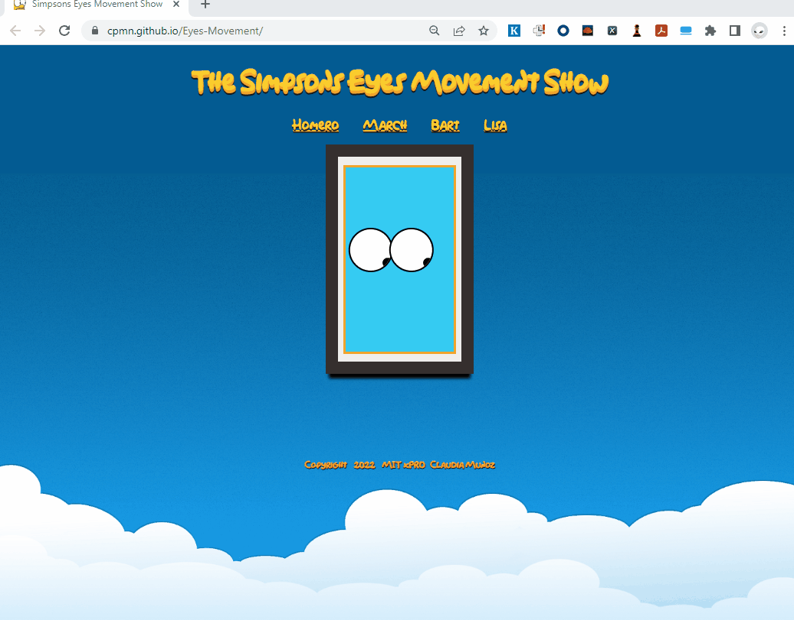

<div align="center" id="top"> 
  
  <!-- <a href="https://eyesmovement.netlify.app">Demo</a> -->
</div>

<h1 align="center">The Simpson's Eyes Movement Show</h1>

<p align="center">
  <a href="#dart-about">Description</a> &#xa0; | &#xa0; 
  <a href="#sparkles-features">Features</a> &#xa0; | &#xa0;
  <a href="#rocket-technologies">Technologies</a> &#xa0; | &#xa0;
  <a href="#white_check_mark-requirements">Requirements</a> &#xa0; | &#xa0;
  <a href="#checkered_flag-starting">Starting</a> &#xa0; | &#xa0;
  <a href="#memo-license">License</a> &#xa0; | &#xa0;
  <a href="https://github.com/cpmn" target="_blank">Author</a>
</p>

<br>

## :dart: Description ##

This project was made during week 8 of MIT xPRO bootcamp, the original asignment was two eyes that follow the mouse pointer as much as you move it. 
Based on the initial project I have created my own version using The Simpson theme, you will move the eyes in Homero, March, Lisa and Bart. 

## :dart: DEMO ##

This website is responsive so you can try from you desktop, laptop, mobile or your table.
Enjoy the live [DEMO](https://cpmn.github.io/Eyes-Movement/)

## :sparkles: Roadmap ##

This are the list currect improvements:

:heavy_check_mark: Feature 1: As a Simpson Fan I would like to have links or buttons to change diferent images representing Simpson's characteres.\
:heavy_check_mark: Feature 2: As a Simpson Fan I would like to apply the eyes movement to  Homero, March, Bart and Lisa faces\
:heavy_check_mark: Feature 3: As a Simpson Fan I would like to see the picture frame with the face of each character\
:heavy_check_mark: Feature 4: As a user I would like to see the title of the page in a fancy sympson format\
:heavy_check_mark: Feature 5: As a user I would like to see the contacts and the copy right;
:heavy_check_mark: Feature 5: As a user I would like to see the webpage using my mobile;

In future enhancemnts:
- Feature 7: As a Simpson Fan I would like to move the mouse following the mouse pointer.
- Feature 8: As a Simpson Fan I would like to add more charactres: Barny, Moe, Krusty, Nelson, Burns, etc.


## :rocket: Technologies ##

The following tools were used in this project:

- [HTML](https://www.w3schools.com/html/)
- [CSS](https://www.w3schools.com/css/)
- [JavaScript](https://www.w3schools.com/js/)

## :white_check_mark: Requirements and How to Run ##

Before starting :checkered_flag:, you need to have [Git](https://git-scm.com) installed.

## :checkered_flag: Starting ##

```bash
# Clone this project
$ git clone https://github.com/cpmn/eyes-movement

# Access
$ cd eyes-movement

# Run index.html in a browser
- [Index.html](index.html)
```
Once the webpage is loaded you will see 4 buttons bellow the title, you can click in any of those buttons and start changing the faces in the portrait and eyes will fit any of those faces.

## :memo: License ##

This project is under license from MIT. For more details, see the [LICENSE](LICENSE) file.


Made with :heart: by <a href="https://github.com/cpmn" target="_blank">Claudia Muñoz</a>

&#xa0;

<a href="#top">Back to top</a>
